## Contents

- Descripción
- 1. Contenido del kit
  - 1.1 Electrónica y alimentación
  - 1.2 Cables, estructura y tornillería
- 2. Alimentación y precauciones
- 3. Funciones del sistema
- 4. Conexiones de referencia
  - 4.1 Shield y módulos
  - 4.2 DualMCU ONE, Hub I²C y PCA9685
  - 4.3 Conexión completa
- 5. Ensamble y puesta en marcha
  - 5.1 Secuencia de ensamble
  - 5.2 Firmware
  - 5.3 Aplicación móvil
- 6. Información mecánica
- 7. Fabricante
- 8. Documentación y recursos
- 9. Control del documento
  - Datos por confirmar
- Manual de usuario migrado
  - Presentación, componentes e
    inventario
  - Ensamble
  - Conexiones y ensamble final
  - Puesta en marcha
  - Recursos y dimensiones

## Descripción

El **Kit SmartHome** (AR4623) de UNIT Electronics integra la tarjeta
**UNIT DualMCU ONE** con ESP32 y RP2040, sensores, actuadores,
comunicación I²C y una aplicación móvil. Este Product Reference
incorpora el contenido del manual de usuario **V1.1.0 del 16 de febrero
de 2026**, incluidos el texto de ensamble, las conexiones, la puesta en
marcha y sus figuras. La migración completa se encuentra en el capítulo
10.

<figure>

<figcaption aria-hidden="true">Kit SmartHome ensamblado, vista
isométrica</figcaption>
</figure>

| Dato                      | Referencia                                              |
|---------------------------|---------------------------------------------------------|
| Producto                  | Kit SmartHome, AR4623                                   |
| Plataforma                | UNIT DualMCU ONE: ESP32 + RP2040                        |
| Alimentación del conjunto | Adaptador de 12 V, 2 A mediante jack                    |
| Comunicación              | Wi-Fi para la app, bus I²C Qwiic, USB para programación |
| Materiales                | MDF, acrílico y piezas impresas en PLA                  |
| Tamaño ensamblado         | 18 × 15 × 19 cm, según el manual V1.1.0                 |
| Tiempo estimado           | 4 h de ensamble y 1 h de puesta en marcha               |
| Aplicación                | Android; APK incluido en `software/App/`                |

Los capítulos 1 a 9 facilitan la consulta por tema. El capítulo 10
conserva el contenido del manual en orden de página, con el texto y las
ilustraciones intercalados. La [galería de figuras](manual-figures.html)
permite abrir cada imagen por separado.

## 1. Contenido del kit

La lista siguiente conserva las cantidades indicadas en el manual
V1.1.0. Antes del ensamble, clasifique las piezas y compruebe que las
conexiones y la tornillería correspondan a cada módulo.

### 1.1 Electrónica y alimentación

| Componente                            | Cantidad | Componente                | Cantidad |
|---------------------------------------|---------:|---------------------------|---------:|
| UNIT DualMCU ONE                      |        1 | Sensor Shield V5.0 UNO R3 |        1 |
| Hub I²C QW/ST                         |        1 | PCA9685                   |        1 |
| Puente H MX1508                       |        1 | Adaptador 12 V / 2 A      |        1 |
| Servomotor SG90                       |        1 | Motor DC con hélice       |        1 |
| Buzzer KY-006                         |        1 | Pantalla OLED SSD1315     |        1 |
| Sensor de flama KY-026                |        1 | Sensor de lluvia FC-37    |        1 |
| Sensor AHT10 de temperatura y humedad |        1 | Fotorresistor KY-018      |        1 |
| Neopixel WS2812                       |        3 | Lector RFID RC522         |        1 |
| Receptor IR HX1838                    |        1 | Botón capacitivo TTP223B  |        1 |
| Encoder KY-040                        |        1 | Sensor PIR HC-SR505       |        1 |

### 1.2 Cables, estructura y tornillería

| Elemento                            | Cantidad | Elemento                             |         Cantidad |
|-------------------------------------|---------:|--------------------------------------|-----------------:|
| Cable Qwiic a Qwiic de 10 cm        |        1 | Cable Qwiic a Dupont hembra de 20 cm |                3 |
| Cable Dupont hembra-hembra de 20 cm |       16 | Cable Dupont macho-hembra de 20 cm   |                2 |
| Dupont fijo de 2 vías               |        3 | Dupont fijo de 3 vías                |                8 |
| Tira header macho de 40 pines       |        1 | Pila de botón de 3 V                 |                1 |
| Tornillo M2×8                       |       12 | Tuerca M2                            |               16 |
| Tornillo M2.5×8                     |       23 | Tuerca M2.5                          |               41 |
| Tornillo M3×6                       |        6 | Tornillo M3×8                        |               18 |
| Tornillo M3×10                      |        5 | Tuerca M3                            |               33 |
| Separador de latón M3×5+6           |        4 | Piezas de MDF e impresas en 3D       | 1 juego cada una |

El manual también muestra las piezas acrílicas y los tornillos propios
de algunos módulos durante el montaje. La lista de inventario completa
con folios KSH01–KSH39 está en el PDF original.

## 2. Alimentación y precauciones

El kit se alimenta con el **adaptador de 12 V, 2 A con jack** incluido.
Esa cifra describe el adaptador del conjunto; no establece por sí sola
los límites eléctricos de cada sensor, del ESP32, del RP2040 ni de los
conectores de la shield. Consulte la documentación de cada módulo antes
de usar otra fuente o agregar cargas externas.

| Punto de revisión                 | Indicación del manual                                                          |
|-----------------------------------|--------------------------------------------------------------------------------|
| Antes de energizar                | Corroborar polaridad, alimentación y posición de todos los conectores.         |
| Neopixel                          | Respetar la polaridad: una conexión invertida puede dañar el módulo.           |
| Cableado de sensores y actuadores | Una mala conexión puede dañar los módulos.                                     |
| Bus I²C                           | Conectar DualMCU ONE al Hub I²C por Qwiic antes de colocar la Sensor Shield.   |
| Motor DC                          | Disponer los cables de modo que el MDF no los corte ni los presione.           |
| Servomotor                        | Energizarlo y colocarlo en la posición inicial antes del montaje de la puerta. |

El manual no aporta una tabla de corriente máxima por puerto ni los
límites de tensión de las señales individuales. Para el cableado use los
diagramas del capítulo 4 y las marcas impresas en cada placa.

## 3. Funciones del sistema

| Subsistema           | Componentes                                  | Función en el kit                                                       |
|----------------------|----------------------------------------------|-------------------------------------------------------------------------|
| Control              | UNIT DualMCU ONE con ESP32 y RP2040          | Ejecuta el firmware del kit y coordina la interfaz móvil y los módulos. |
| Entradas ambientales | AHT10, KY-018, FC-37, KY-026, HC-SR505       | Lectura de temperatura, humedad, luz, lluvia, flama y movimiento.       |
| Entradas de usuario  | KY-040, TTP223B, RC522, HX1838               | Interacción por encoder, tacto, RFID e infrarrojo.                      |
| Salidas              | SG90, motor DC, buzzer, tres WS2812, OLED    | Movimiento, aviso, iluminación y visualización.                         |
| Expansión y control  | Sensor Shield V5.0, Hub I²C, PCA9685, MX1508 | Distribución de conexiones, bus I²C, PWM y manejo del motor.            |
| Aplicación           | App SmartHome para Android                   | Presenta lecturas de sensores y controles de actuadores.                |

<figure>
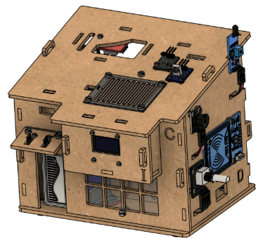
<figcaption aria-hidden="true">Conjunto montado con electrónica
visible</figcaption>
</figure>

El aprendizaje práctico incluye control PWM, comunicación I²C y lectura
de señales analógicas y digitales. Las funciones disponibles en la app
dependen del firmware instalado en ambos microcontroladores.

## 4. Conexiones de referencia

La **Sensor Shield** concentra conexiones directas de encoder, buzzer,
RFID, sensor de flama, PIR, botón capacitivo, lluvia, infrarrojo,
fotorresistor y Neopixel. El **Hub I²C** conecta la pantalla OLED y el
AHT10; el manual indica que estos cables pueden ocupar cualquiera de sus
posiciones equivalentes. El **PCA9685** se usa con el servomotor y el
**MX1508** con el motor DC.

### 4.1 Shield y módulos

<figure>
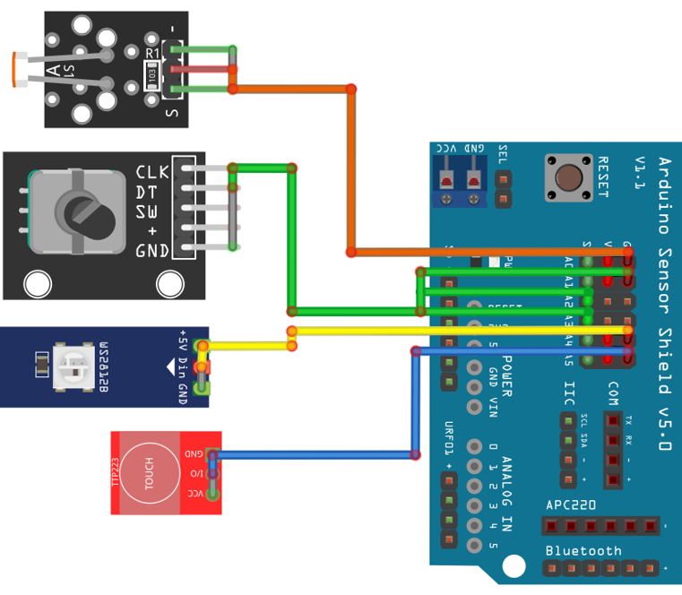
<figcaption aria-hidden="true">Diagrama resumido de conexiones a la
Sensor Shield</figcaption>
</figure>

<figure>
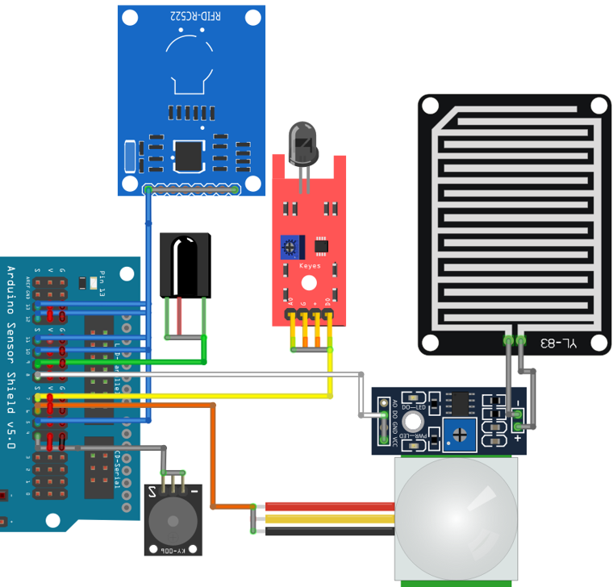
<figcaption aria-hidden="true">Segundo diagrama resumido de conexiones a
la Sensor Shield</figcaption>
</figure>

### 4.2 DualMCU ONE, Hub I²C y PCA9685

<figure>
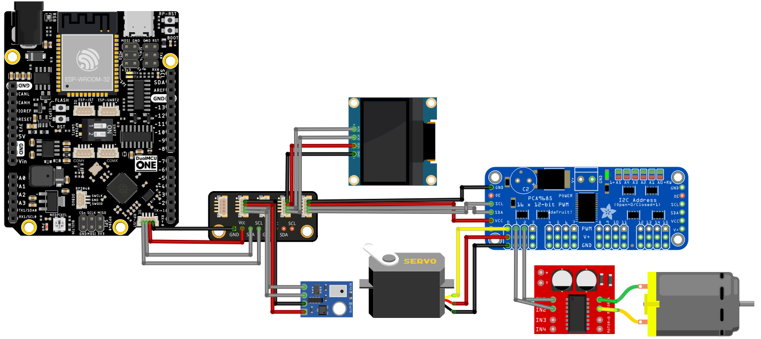
<figcaption aria-hidden="true">Conexión de DualMCU ONE, Hub I2C y
PCA9685</figcaption>
</figure>

### 4.3 Conexión completa

<figure>
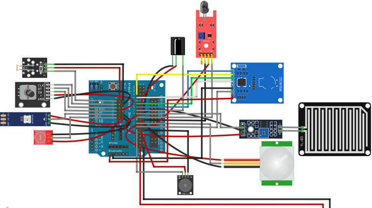
<figcaption aria-hidden="true">Diagrama completo de conexiones del
kit</figcaption>
</figure>

El segundo diagrama completo del manual está disponible como [figura
adicional](assets/manual/image-279.png). Revise la orientación de VCC,
GND y señal en cada conector antes de aplicar energía. Los diagramas son
la fuente visual de asignaciones específicas; esta referencia no
sustituye la comprobación física del cableado.

## 5. Ensamble y puesta en marcha

### 5.1 Secuencia de ensamble

1.  Inventariar las piezas y reunir desarmadores, pinzas y cautín.
    Colocar la pila de botón en el control IR y soldar los pines de los
    módulos que lo requieren.
2.  Energizar el SG90 para ubicar su posición inicial; después montar la
    puerta y la base MDF-A.
3.  Montar las paredes, los techos y los módulos. El manual desglosa
    esta etapa en los ensambles 1.1 a 1.9.
4.  Atornillar la DualMCU ONE y conectar su cable Qwiic al Hub I²C antes
    de instalar la Sensor Shield.
5.  Conectar sensores, OLED, servo, Neopixel y motor a la shield, Hub
    I²C, PCA9685 o MX1508 conforme a los diagramas del capítulo 4.
6.  Cerrar la estructura y revisar que ningún cable quede pellizcado.
    Verificar polaridad y ausencia de cortocircuitos antes de alimentar
    con el adaptador.

<figure>
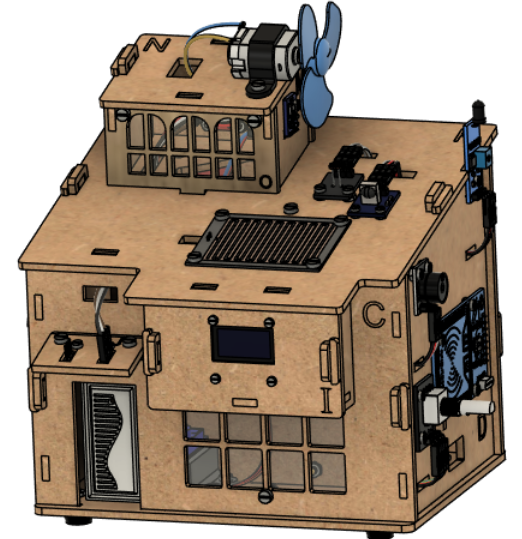
<figcaption aria-hidden="true">Ensamble final de la casa</figcaption>
</figure>

El capítulo 10 incluye todas las páginas del manual migradas a esta
referencia, con las vistas y la posición de cada tornillo. También puede
abrir cada figura desde la [galería de imágenes](manual-figures.html).

### 5.2 Firmware

La DualMCU ONE se entrega con firmware pregrabado. Si requiere
reinstalarlo, abra en Arduino IDE los programas del repositorio:

| Procesador | Programa local                                                         | Acción                                                                                              |
|------------|------------------------------------------------------------------------|-----------------------------------------------------------------------------------------------------|
| ESP32      | `software/ESP32/Smart_Home_App_ESP_COMV4/Smart_Home_App_ESP_COMV4.ino` | Cargar primero los datos LittleFS con el complemento indicado en el manual y luego subir el sketch. |
| RP2040     | `software/RP2040/Smart_Home_RP_V1/Smart_Home_RP_V1.ino`                | Compilar y cargar el sketch para la placa correspondiente.                                          |

El complemento LittleFS y la configuración de placa dependen de la
versión del IDE. El manual explica el proceso de carga y el uso del
botón BOOT cuando la conexión no ocurre automáticamente.

### 5.3 Aplicación móvil

El APK está en `software/App/smartHomeApp.apk`. Instálelo en Android
desde la fuente oficial del repositorio. Al abrir la app, el botón
**Ayuda** describe sus funciones. El manual muestra la visualización de
sensores y los controles de actuadores, pero deja sin instrucciones
desarrolladas las secciones «Primera conexión», «Uso de la app» y «Modo
Offline»; no se deben inferir pasos de emparejamiento a partir de esos
títulos.

<figure>

<figcaption aria-hidden="true">Vista de sensores en la
aplicación</figcaption>
</figure>

## 6. Información mecánica

| Parámetro                      | Valor del manual V1.1.0                            |
|--------------------------------|----------------------------------------------------|
| Dimensiones del kit ensamblado | 18 × 15 × 19 cm                                    |
| Dimensiones del empaque        | 27 × 17 × 15 cm                                    |
| Materiales principales         | MDF, acrílico y PLA                                |
| Tornillería                    | Tornillos milimétricos de cabeza de queso ranurada |
| Peso total                     | No indicado                                        |

<figure>
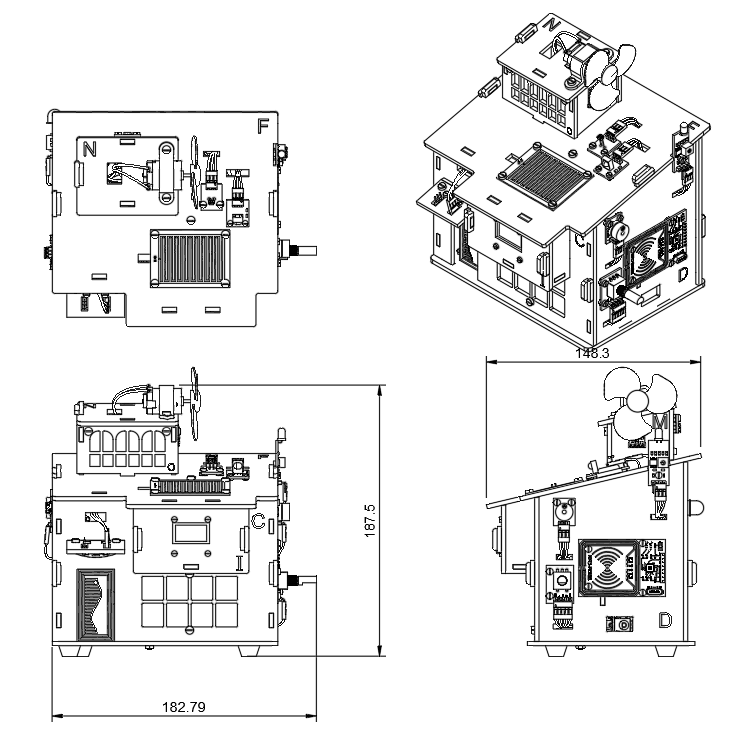
<figcaption aria-hidden="true">Vistas dimensionales del kit</figcaption>
</figure>

Estas medidas corresponden al documento V1.1.0. La portada del
repositorio da una medida distinta para el conjunto (16 × 15 × 19 cm);
para fabricación de envolventes o embalaje debe confirmarse la dimensión
con una medición controlada del kit físico.

## 7. Fabricante

| Campo      | Información                                   |
|------------|-----------------------------------------------|
| Fabricante | UNIT Electronics                              |
| Sitio web  | [uelectronics.com](https://uelectronics.com/) |
| Plataforma | UNIT DevLab / Kit SmartHome                   |

Para asistencia y actualizaciones de software, consulte el repositorio
del producto en el capítulo 8.

## 8. Documentación y recursos

| Recurso                                  | Ubicación                                                                                           |
|------------------------------------------|-----------------------------------------------------------------------------------------------------|
| Documento fuente V1.1.0                  | [PDF original](assets/I2D-Manual%20de%20usuario%20-%20Kit%20SmartHome-280926-171843.pdf)            |
| Manual migrado dentro de esta referencia | Capítulo 10, «Manual de usuario migrado»                                                            |
| Figuras del manual extraídas localmente  | [Galería de figuras](manual-figures.html)                                                           |
| Repositorio del producto                 | [UNIT-Electronics-MX/unit_kit_smarthome](https://github.com/UNIT-Electronics-MX/unit_kit_smarthome) |
| Firmware ESP32                           | `software/ESP32/Smart_Home_App_ESP_COMV4/`                                                          |
| Firmware RP2040                          | `software/RP2040/Smart_Home_RP_V1/`                                                                 |
| Aplicación Android                       | `software/App/smartHomeApp.apk`                                                                     |
| Arduino IDE                              | [Documentación oficial](https://docs.arduino.cc/software/ide/)                                      |

Los enlaces de archivos locales se refieren a las rutas del repositorio.
La galería publica todas las imágenes extraídas para su consulta desde
la página web.

## 9. Control del documento

| Campo                     | Valor                                                           |
|---------------------------|-----------------------------------------------------------------|
| Producto                  | Kit SmartHome, AR4623                                           |
| Versión del manual fuente | 1.1.0                                                           |
| Fecha del manual fuente   | 16 de febrero de 2026                                           |
| Autores del manual fuente | Juan Luis Ballesteros y José Carlos Serrato                     |
| Documento derivado        | Product Reference V1.1.0                                        |
| Fuente de las imágenes    | PDF de 80 páginas incluido en `tools/product-reference/assets/` |

Las imágenes se extrajeron sin depender de servidores externos. El
archivo `assets/manual/manifest.tsv` relaciona cada imagen con su página
de origen y su número dentro del PDF. Los objetos `smask` son máscaras
de transparencia extraídas junto con las imágenes; también se conservan
en `assets`.

### Datos por confirmar

- El manual deja sin valor el peso total.
- La dimensión ensamblada del manual (18 × 15 × 19 cm) difiere de la
  portada del repositorio (16 × 15 × 19 cm).
- El manual no incluye instrucciones desarrolladas para primera
  conexión, uso de la app ni modo sin conexión.
- No se especifican límites eléctricos por puerto ni un pinout numérico
  completo en texto; para el cableado se deben usar los diagramas
  visuales del manual.

## Manual de usuario migrado

Contenido del manual V1.1.0 incorporado en esta referencia. El texto y
las ilustraciones aparecen por página de origen; los saltos de línea y
las tablas se adaptaron a Markdown para consulta en la web.

### Presentación, componentes e inventario

#### Página 1 del manual

Manual de usuario - Kit SmartHome

Manual de usuario

<figure>

<figcaption aria-hidden="true">Manual de usuario, página 1, imagen
0</figcaption>
</figure>

<figure>

<figcaption aria-hidden="true">Manual de usuario, página 1, imagen
2</figcaption>
</figure>

Área: I2D

Producto: AR4623 - Kit SmartHome

Versión: 1.1.0

Fecha: 16/02/2026

Autores: Juan Luis Ballesteros, José Carlos Serrato

Tiempo estimado de lectura: 12 minutos

Tiempo estimado de ensamble: 4 horas

#### Página 2 del manual

Tiempo estimado de puesta en funcionamiento: 1 hora

Control de versiones

| Versión | Fecha      | Nombre       | Cambios realizados                                                                                    |
|---------|------------|--------------|-------------------------------------------------------------------------------------------------------|
| V1.1.0  | 16/02/2026 | José Serrato | Cambio de motor, mejora de ensamble (electrónica y espacio asignado) y plantillas de corte mejoradas. |
| V1.0.1  | —          | José Serrato | Corrección de puentes en corte láser.                                                                 |
| V1.0.0  | —          | José Serrato | Creación del proyecto, primer borrador.                                                               |

Introducción  
El Kit SmartHome de UNIT Electronics es una plataforma didáctica
diseñada para el aprendizaje  
práctica de electrónica y programación mediante la construcción de una
casa inteligente  
funcional.

El usuario ensamblará piezas mecánicas, integrará electrónica modular,
hará uso del control  
PWM, el protocolo de comunicación I2C y realizará lectura de sensores
tanto digitales como  
analógicos, todo con apoyo de una aplicación móvil.

El kit integra múltiples sensores y actuadores, controlados por la
tarjeta de desarrollo UNIT  
DualMCU ONE, que incorpora los microcontroladores:

ESP32  
RP2040

La UNIT DualMCU ONE permite trabajar con:

Arduino IDE  
MicroPython  
CircuitPython  
Raspberry Pi C/C++ SDK

Materiales:

MDF  
Acrílico  
PLA (Impresiones 3D)

#### Página 3 del manual

Fuente de alimentación:

Eliminador 12V 2A mediante Jack.

Sensores:

Sensor de flama KY-026  
Sensor de lluvia FC-37  
Sensor de temperatura y humedad AHT10  
Sensor fotorresistor KY-018  
Neopixel  
RFID RC522 (con tarjeta y llavero)  
IR HX1838  
Botón capacitivo TTP223B  
Encoder KY-040  
Sensor de movimiento PIR HC-SR505

Actuadores:

Servomotor SG90  
Buzzer pasivo KY-006  
Display Oled 0.96” SSD1306  
Motor DC (con hélice)

Módulos y electrónica:

Tarjeta de desarrollo UNIT DualMCU ONE ESP32 + RP2040  
Hub I2C QW/ST  
Puente H MX1508  
PCA9685  
Sensor Shield V5  
Eliminador 12V 2A Jack

Cables:

Qwiic a Qwiic  
Qwiic a Dupont (M-H)  
Dupont - Dupont (H-H)  
Dupont - Dupont (H-M)  
Dupont - Dupont (H-H Fijo 2 vías)

#### Página 4 del manual

Dupont - Dupont (H-H Fijo 3 vías)

Tornillería:

M2x8  
M2.5x8  
M3x6  
M3x8  
M3x10  
Separador de latón  
Tuercas M2  
Tuercas M2.5  
Tuercas M3

Herramientas recomendadas para el ensamble:

Desarmador plano  
Desarmador de cruz  
Pinzas de punta delgada o pinzas SMD (te serán útil al momento de
cablear)  
Cautín

Herramientas no incluidas

#### Página 5 del manual

<figure>
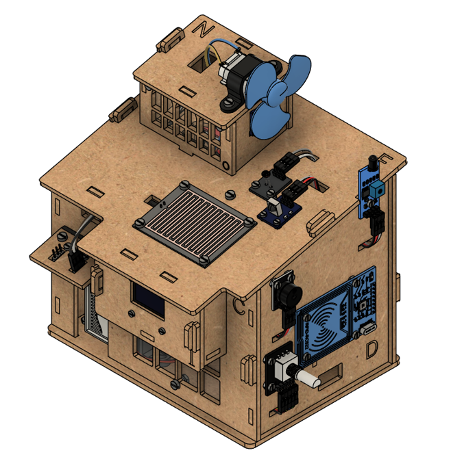
<figcaption aria-hidden="true">Manual de usuario, página 5, imagen
3</figcaption>
</figure>

Lista de materiales

| Folio | Descripción            | Imagen                                                     | Cantidad |
|-------|------------------------|------------------------------------------------------------|---------:|
| KSH01 | M2x8 queso ranurada    | 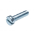                         |       12 |
| KSH02 | M2.5x8 queso ranurada  |                        |       23 |
| KSH03 | M3x6 queso ranurada    |                          |        6 |
| KSH04 | M3x8 queso ranurada    |                          |       18 |
| KSH05 | M3x10 queso ranurada   |                         |        5 |
| KSH06 | M3x5+6 separador latón | 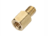                      |        4 |

#### Página 6 del manual

| Folio | Descripción                           | Imagen                                                     | Cantidad |
|-------|---------------------------------------|------------------------------------------------------------|---------:|
| KSH07 | M2 tuerca                             |                                    |       16 |
| KSH08 | M2.5 tuerca                           |                                  |       41 |
| KSH09 | M3 tuerca                             |                                    |       33 |
| KSH10 | UNIT DualMCU ONE                      | 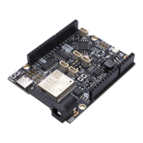                            |        1 |
| KSH11 | SG90 Servomotor                       |                              |        1 |
| KSH12 | KY-006 Buzzer                         | 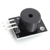                               |        1 |
| KSH13 | KY-026 Sensor de flama                | 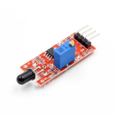                      |        1 |
| KSH14 | FC-37 Sensor de lluvia                | 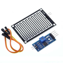                      |        1 |
| KSH15 | AHT10 Sensor de temperatura y humedad | 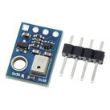       |        1 |

#### Página 7 del manual

| Folio | Descripción               | Imagen                                                     | Cantidad |
|-------|---------------------------|------------------------------------------------------------|---------:|
| KSH16 | SSD1315 Pantalla OLED     | 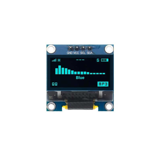                       |        1 |
| KSH17 | KY-018 Fotorresistor      | 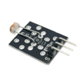                        |        1 |
| KSH18 | WS2812 Neopixel           | 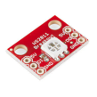                             |        3 |
| KSH19 | RC522 Sensor RFID         | 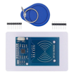                           |        1 |
| KSH20 | HX1838 Sensor IR          |                             |        1 |
| KSH21 | TTP223B Botón Capacitivo  | 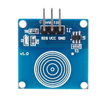                    |        1 |
| KSH22 | KY-040 Encoder            | 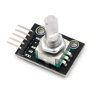                              |        1 |
| KSH23 | UNIT Módulo Hub I2C QW/ST | 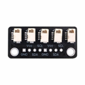                   |        1 |
| KSH24 | HC-SR505 PIR              | 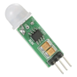                                |        1 |
| KSH25 | Motor DC con Hélice       | 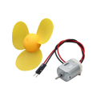                         |        1 |

#### Página 8 del manual

| Folio | Descripción                       | Imagen                                                     | Cantidad |
|-------|-----------------------------------|------------------------------------------------------------|---------:|
| KSH26 | MX1508 Puente H                   | 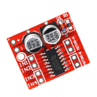                             |        1 |
| KSH27 | PCA9685                           | 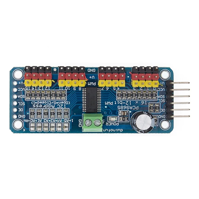                                     |        1 |
| KSH28 | Sensor Shield V5.0 UNO R3         | 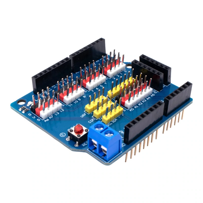                   |        1 |
| KSH29 | Eliminador 12V 2A Jack            |                       |        1 |
| KSH30 | Cable Qwiic - Qwiic 10 cm         | 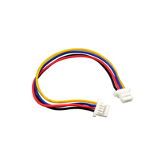                   |        1 |
| KSH31 | Cable Qwiic - Dupont Hembra 20 cm |            |        3 |
| KSH32 | Cable Dupont H-H 20 cm            | 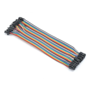                      |       16 |

#### Página 9 del manual

| Folio | Descripción                  | Imagen                                                     | Cantidad |
|-------|------------------------------|------------------------------------------------------------|---------:|
| KSH33 | Cable Dupont M-H 20 cm       | 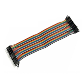                      |        2 |
| KSH34 | Cable Dupont H-H Fijo 2 vías | 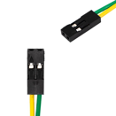                |        3 |
| KSH35 | Cable Dupont H-H Fijo 3 vías | 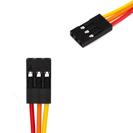                |        8 |
| KSH36 | Tira Header Macho 40 pines   | 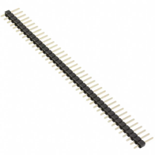                  |        1 |
| KSH37 | Pila de Botón 3V             |                             |        1 |
| KSH38 | Juego de impresiones         | 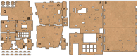                        |  1 juego |
| KSH39 | Juego de cortes en MDF       | 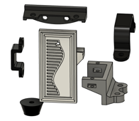                      |  1 juego |

1.- Ensamble

Objetivo:

### Ensamble

#### Página 10 del manual

Guiar al usuario en el ensamble de los componentes del Kit SmartHome,
asegurando la correcta  
instalación de la estructura como de la electrónica, así como conexiones
de cables a los  
módulos.

Resultado esperado:

Estructura de la casa ensamblada con la electrónica atornillada y
cableado preparado para su  
conexión con la shield.

<figure>
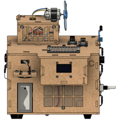
<figcaption aria-hidden="true">Manual de usuario, página 10, imagen
43</figcaption>
</figure>

<figure>
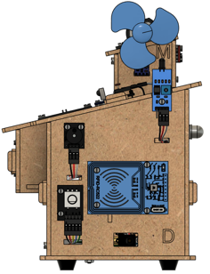
<figcaption aria-hidden="true">Manual de usuario, página 10, imagen
44</figcaption>
</figure>

<figure>
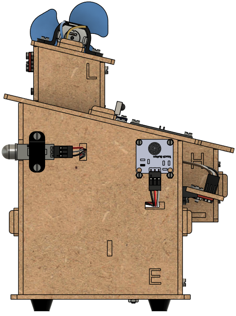
<figcaption aria-hidden="true">Manual de usuario, página 10, imagen
45</figcaption>
</figure>

Vista frontal

Vista lateral Derecha

Vista lateral Izquierda

<figure>
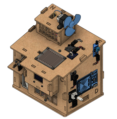
<figcaption aria-hidden="true">Manual de usuario, página 10, imagen
48</figcaption>
</figure>

<figure>
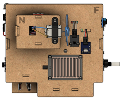
<figcaption aria-hidden="true">Manual de usuario, página 10, imagen
46</figcaption>
</figure>

<figure>
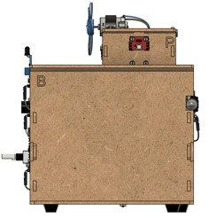
<figcaption aria-hidden="true">Manual de usuario, página 10, imagen
47</figcaption>
</figure>

Vista superior

Vista Isométrica

Vista posterior

Resultado final esperado terminada la sección Ensamble.

Desarrollo:

Recomendaciones:

Ubica todas las piezas del apartado previo al ensamble  
Reúne las herramientas mencionadas en la introducción  
Retira los cortes de MDF de su marco conforme se utilicen, con la
intención de tener un  
ensamble más organizado  
Coloca la pila de botón CR2025 al control infrarrojo  
Suelda los pines de los módulos previo a su ensamble

#### Página 11 del manual

<figure>
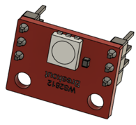
<figcaption aria-hidden="true">Manual de usuario, página 11, imagen
49</figcaption>
</figure>

<figure>
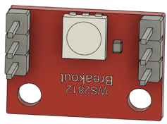
<figcaption aria-hidden="true">Manual de usuario, página 11, imagen
50</figcaption>
</figure>

Pines en cara superior (1  
módulo)

Pines en cara posterior (2  
módulos)

Pines módulos Neopixel

<figure>
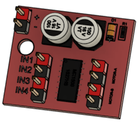
<figcaption aria-hidden="true">Manual de usuario, página 11, imagen
51</figcaption>
</figure>

Pines soldados Puente H

<figure>
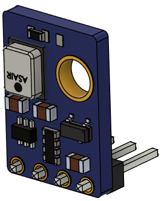
<figcaption aria-hidden="true">Manual de usuario, página 11, imagen
52</figcaption>
</figure>

Pines soldados AHT10

<figure>
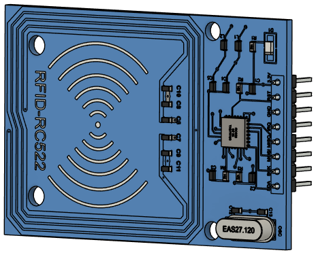
<figcaption aria-hidden="true">Manual de usuario, página 11, imagen
53</figcaption>
</figure>

Pines soldados RC522

#### Página 12 del manual

Procedimiento de ensamble:

Ubicación de componentes de la sección  
Ensamble de módulos  
Cableado del módulo

Precaución: Una mala conexión puede provocar daño en los módulos

1.0 - Preparación

Para evitar problemas de ensamble, se requiere energizar el servomotor
para dejar la posición  
inicial correcta. Sigue el siguiente diagrama y realiza las conexiones
necesarias.

Nota: Es necesario montar la shield a la DualONE. En el diagrama se
muestran separadas  
para un mejor entendimiento.

<figure>
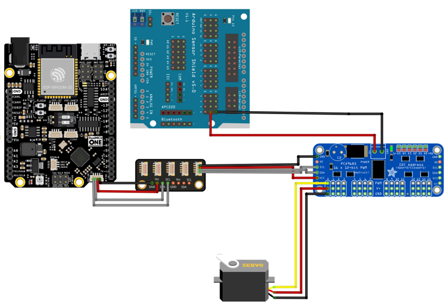
<figcaption aria-hidden="true">Manual de usuario, página 12, imagen
54</figcaption>
</figure>

Conexi

1.1 - Base (A)

#### Página 13 del manual

<figure>
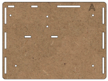
<figcaption aria-hidden="true">Manual de usuario, página 13, imagen
55</figcaption>
</figure>

<figure>
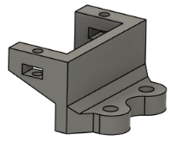
<figcaption aria-hidden="true">Manual de usuario, página 13, imagen
58</figcaption>
</figure>

<figure>
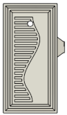
<figcaption aria-hidden="true">Manual de usuario, página 13, imagen
56</figcaption>
</figure>

<figure>

<figcaption aria-hidden="true">Manual de usuario, página 13, imagen
57</figcaption>
</figure>

<figure>

<figcaption aria-hidden="true">Manual de usuario, página 13, imagen
59</figcaption>
</figure>

Brazo Servomotor

Regatones (4  
pzs)

MDF - A

Base Servomotor

Puerta

<figure>

<figcaption aria-hidden="true">Manual de usuario, página 13, imagen
60</figcaption>
</figure>

<figure>

<figcaption aria-hidden="true">Manual de usuario, página 13, imagen
62</figcaption>
</figure>

<figure>

<figcaption aria-hidden="true">Manual de usuario, página 13, imagen
63</figcaption>
</figure>

<figure>

<figcaption aria-hidden="true">Manual de usuario, página 13, imagen
61</figcaption>
</figure>

<figure>

<figcaption aria-hidden="true">Manual de usuario, página 13, imagen
64</figcaption>
</figure>

M3x10 (2 pzs)

Pija M2.8

M3x8 (4 pzs)

Tornillo  
Servomotor

Servomotor

<figure>

<figcaption aria-hidden="true">Manual de usuario, página 13, imagen
65</figcaption>
</figure>

<figure>

<figcaption aria-hidden="true">Manual de usuario, página 13, imagen
66</figcaption>
</figure>

<figure>

<figcaption aria-hidden="true">Manual de usuario, página 13, imagen
67</figcaption>
</figure>

M2x8 (2 pzs)

M3 (6 pzs)

M2 (2pzs)

<figure>

<figcaption aria-hidden="true">Manual de usuario, página 13, imagen
68</figcaption>
</figure>

#### Página 14 del manual

<figure>

<figcaption aria-hidden="true">Manual de usuario, página 14, imagen
69</figcaption>
</figure>

MDF-A + 4x tornillos M3x8 + 4x tuercas M3 +  
4x regatones  
Repite el paso en las 4 esquinas.

<figure>

<figcaption aria-hidden="true">Manual de usuario, página 14, imagen
70</figcaption>
</figure>

#### Página 15 del manual

<figure>

<figcaption aria-hidden="true">Manual de usuario, página 15, imagen
71</figcaption>
</figure>

Puerta + Base servomotor + 2x tornillos M2x8 + 2x tuercas M2 +  
tornillo y pija servomotor (estos últimos se ubican junto con el  
servomotor)

<figure>

<figcaption aria-hidden="true">Manual de usuario, página 15, imagen
72</figcaption>
</figure>

#### Página 16 del manual

<figure>

<figcaption aria-hidden="true">Manual de usuario, página 16, imagen
73</figcaption>
</figure>

2x tornillos M3x10 + 2x tuercas M3

<figure>

<figcaption aria-hidden="true">Manual de usuario, página 16, imagen
74</figcaption>
</figure>

Ensamble 1.1

1.2 - Pared (C) + Techo (J)

<figure>

<figcaption aria-hidden="true">Manual de usuario, página 16, imagen
78</figcaption>
</figure>

<figure>

<figcaption aria-hidden="true">Manual de usuario, página 16, imagen
75</figcaption>
</figure>

<figure>

<figcaption aria-hidden="true">Manual de usuario, página 16, imagen
76</figcaption>
</figure>

<figure>

<figcaption aria-hidden="true">Manual de usuario, página 16, imagen
77</figcaption>
</figure>

<figure>

<figcaption aria-hidden="true">Manual de usuario, página 16, imagen
79</figcaption>
</figure>

Impresión  
anclaje J

M3x8 (4 pzs)

MDF - J

MDF - C

Acrílico inferior

<figure>

<figcaption aria-hidden="true">Manual de usuario, página 16, imagen
81</figcaption>
</figure>

<figure>

<figcaption aria-hidden="true">Manual de usuario, página 16, imagen
80</figcaption>
</figure>

<figure>

<figcaption aria-hidden="true">Manual de usuario, página 16, imagen
83</figcaption>
</figure>

<figure>

<figcaption aria-hidden="true">Manual de usuario, página 16, imagen
84</figcaption>
</figure>

<figure>

<figcaption aria-hidden="true">Manual de usuario, página 16, imagen
82</figcaption>
</figure>

Dupont fijo 3  
vías

M2.5x8 (2 pzs)

M3x6 (2 pzs)

M3 (6 pzs)

M2.5 (2  
pzs)

#### Página 17 del manual

<figure>

<figcaption aria-hidden="true">Manual de usuario, página 17, imagen
85</figcaption>
</figure>

Neopixel

Precaución: Cuida la polaridad de los Neopixel, una mala conexión puede
quemar los  
Neopixel.

<figure>

<figcaption aria-hidden="true">Manual de usuario, página 17, imagen
86</figcaption>
</figure>

<figure>

<figcaption aria-hidden="true">Manual de usuario, página 17, imagen
87</figcaption>
</figure>

MDF-C + Acrílico Inferior + 2x tornillos M3x8 + 2x  
tuercas M3

#### Página 18 del manual

<figure>

<figcaption aria-hidden="true">Manual de usuario, página 18, imagen
88</figcaption>
</figure>

Impresión anclaje J + 2x tornillos M3x8 + 2x tuercas  
M3

<figure>

<figcaption aria-hidden="true">Manual de usuario, página 18, imagen
89</figcaption>
</figure>

MDF-J + Neopixel + 2x tornillos M2.5 +  
2x tuercas M2.5

<figure>

<figcaption aria-hidden="true">Manual de usuario, página 18, imagen
90</figcaption>
</figure>

#### Página 19 del manual

<figure>

<figcaption aria-hidden="true">Manual de usuario, página 19, imagen
91</figcaption>
</figure>

2x tornillos M3x6 + 2x tuercas M3

<figure>

<figcaption aria-hidden="true">Manual de usuario, página 19, imagen
92</figcaption>
</figure>

<figure>

<figcaption aria-hidden="true">Manual de usuario, página 19, imagen
93</figcaption>
</figure>

\+ Dupont fijo 3 vías  
Ensamble 1.2

Conecta los cables por los espacios designados para agilizar el proceso

1.3 - Paredes (H) + Pared (I) + Base (G) + Ensamble 1.2

#### Página 20 del manual

<figure>

<figcaption aria-hidden="true">Manual de usuario, página 20, imagen
96</figcaption>
</figure>

<figure>

<figcaption aria-hidden="true">Manual de usuario, página 20, imagen
94</figcaption>
</figure>

<figure>

<figcaption aria-hidden="true">Manual de usuario, página 20, imagen
95</figcaption>
</figure>

<figure>

<figcaption aria-hidden="true">Manual de usuario, página 20, imagen
97</figcaption>
</figure>

<figure>

<figcaption aria-hidden="true">Manual de usuario, página 20, imagen
98</figcaption>
</figure>

MDF - Llave (4  
pzs)

MDF - G

MDF - I

MDF - H  
(2 pzs)

Ensamble 1.2

<figure>

<figcaption aria-hidden="true">Manual de usuario, página 20, imagen
99</figcaption>
</figure>

<figure>

<figcaption aria-hidden="true">Manual de usuario, página 20, imagen
100</figcaption>
</figure>

<figure>

<figcaption aria-hidden="true">Manual de usuario, página 20, imagen
101</figcaption>
</figure>

<figure>

<figcaption aria-hidden="true">Manual de usuario, página 20, imagen
102</figcaption>
</figure>

M2x8 (4 pzs)

M2 (4 pzs)

Cable Qwiic a  
Dupont

Pantalla OLED

<figure>

<figcaption aria-hidden="true">Manual de usuario, página 20, imagen
103</figcaption>
</figure>

2x MDF-H + MDF-G

<figure>

<figcaption aria-hidden="true">Manual de usuario, página 20, imagen
104</figcaption>
</figure>

\+ MDF-I

#### Página 21 del manual

<figure>

<figcaption aria-hidden="true">Manual de usuario, página 21, imagen
105</figcaption>
</figure>

Pantalla OLED + 4x tornillos M2x8 + 4x tuercas M2

<figure>

<figcaption aria-hidden="true">Manual de usuario, página 21, imagen
106</figcaption>
</figure>

#### Página 22 del manual

<figure>

<figcaption aria-hidden="true">Manual de usuario, página 22, imagen
107</figcaption>
</figure>

\+ Cable Qwiic a dupont

<figure>

<figcaption aria-hidden="true">Manual de usuario, página 22, imagen
108</figcaption>
</figure>

#### Página 23 del manual

<figure>

<figcaption aria-hidden="true">Manual de usuario, página 23, imagen
110</figcaption>
</figure>

<figure>

<figcaption aria-hidden="true">Manual de usuario, página 23, imagen
109</figcaption>
</figure>

\+ 4x MDF-Llave

<figure>

<figcaption aria-hidden="true">Manual de usuario, página 23, imagen
111</figcaption>
</figure>

Ensamble 1.3

1.4 - Pared (D)

<figure>

<figcaption aria-hidden="true">Manual de usuario, página 23, imagen
116</figcaption>
</figure>

<figure>

<figcaption aria-hidden="true">Manual de usuario, página 23, imagen
112</figcaption>
</figure>

<figure>

<figcaption aria-hidden="true">Manual de usuario, página 23, imagen
113</figcaption>
</figure>

<figure>

<figcaption aria-hidden="true">Manual de usuario, página 23, imagen
114</figcaption>
</figure>

<figure>

<figcaption aria-hidden="true">Manual de usuario, página 23, imagen
115</figcaption>
</figure>

Lector RFID

Encoder

Buzzer

MDF - D

Sensor  
de  
flama

#### Página 24 del manual

<figure>

<figcaption aria-hidden="true">Manual de usuario, página 24, imagen
117</figcaption>
</figure>

<figure>

<figcaption aria-hidden="true">Manual de usuario, página 24, imagen
118</figcaption>
</figure>

<figure>

<figcaption aria-hidden="true">Manual de usuario, página 24, imagen
119</figcaption>
</figure>

<figure>

<figcaption aria-hidden="true">Manual de usuario, página 24, imagen
120</figcaption>
</figure>

<figure>

<figcaption aria-hidden="true">Manual de usuario, página 24, imagen
121</figcaption>
</figure>

Dupont fijo 2  
vías

Dupont fijo 3  
vías

M2.5x8 (9 pzs)

Dupont H-H (7  
pzs)

M2.5 (18  
pzs)

<figure>

<figcaption aria-hidden="true">Manual de usuario, página 24, imagen
122</figcaption>
</figure>

<figure>

<figcaption aria-hidden="true">Manual de usuario, página 24, imagen
123</figcaption>
</figure>

9 tornillos M2.5x8 + 18 tuercas M2.5 + Encoder + Lector RFID +  
Buzzer + Sensor de flama

#### Página 25 del manual

Orden de ensamble. Tornillo, módulo, tuerca (funciona como separador y
mantiene en su  
lugar al módulo), MDF y tuerca.

<figure>

<figcaption aria-hidden="true">Manual de usuario, página 25, imagen
124</figcaption>
</figure>

Imagen lateral MDF-D con módulos ensamblados

#### Página 26 del manual

<figure>

<figcaption aria-hidden="true">Manual de usuario, página 26, imagen
125</figcaption>
</figure>

Coloca los cables correspondientes a los módulos + 3x Dupont fijo 3  
vías + Dupont fijo 2 vías + 7x cables dupont H-H

Encoder: Dupont fijo 3 vías + Dupont fijo 2 vías  
Buzzer: Dupont fijo 3 vías  
Flama: Dupont fijo 3 vías  
RFID: 7 cables dupont H-H

#### Página 27 del manual

<figure>

<figcaption aria-hidden="true">Manual de usuario, página 27, imagen
126</figcaption>
</figure>

Ensamble MDF - D con módulos y cables, organizados.  
Ensamble 1.4

1.5 - Pared (D)

<figure>

<figcaption aria-hidden="true">Manual de usuario, página 27, imagen
127</figcaption>
</figure>

<figure>

<figcaption aria-hidden="true">Manual de usuario, página 27, imagen
128</figcaption>
</figure>

<figure>

<figcaption aria-hidden="true">Manual de usuario, página 27, imagen
129</figcaption>
</figure>

<figure>

<figcaption aria-hidden="true">Manual de usuario, página 27, imagen
130</figcaption>
</figure>

<figure>

<figcaption aria-hidden="true">Manual de usuario, página 27, imagen
131</figcaption>
</figure>

M3x8 (2 pzs)

PIR

MDF - E

Botón  
Capacitivo

Soporte  
PIR

<figure>

<figcaption aria-hidden="true">Manual de usuario, página 27, imagen
132</figcaption>
</figure>

<figure>

<figcaption aria-hidden="true">Manual de usuario, página 27, imagen
133</figcaption>
</figure>

<figure>

<figcaption aria-hidden="true">Manual de usuario, página 27, imagen
134</figcaption>
</figure>

<figure>

<figcaption aria-hidden="true">Manual de usuario, página 27, imagen
135</figcaption>
</figure>

<figure>

<figcaption aria-hidden="true">Manual de usuario, página 27, imagen
136</figcaption>
</figure>

Dupont fijo 3  
vías

M2x8 (4 pzs)

M3 (2 pzs)

Dupont H-H (3  
pzs)

M2 (8 pzs)

#### Página 28 del manual

<figure>

<figcaption aria-hidden="true">Manual de usuario, página 28, imagen
137</figcaption>
</figure>

MDF-E

<figure>

<figcaption aria-hidden="true">Manual de usuario, página 28, imagen
138</figcaption>
</figure>

2x tornillos M3x8 + 2x tuercas M3 + Soporte PIR + PIR

#### Página 29 del manual

<figure>

<figcaption aria-hidden="true">Manual de usuario, página 29, imagen
139</figcaption>
</figure>

4x tornillos M2x8 + 8x tuercas M2 + Botón capacitivo

Recuerda el orden correcto. Tornillo, módulo, tuerca, MDF, tuerca.

<figure>

<figcaption aria-hidden="true">Manual de usuario, página 29, imagen
140</figcaption>
</figure>

3x Dupont H-H + Dupont fijo 3 vías  
Ensamble 1.5

#### Página 30 del manual

PIR: 3x Dupont H-H  
Botón Capacitivo: Dupont Fijo 3 vías

1.6 - Techo (F)

<figure>

<figcaption aria-hidden="true">Manual de usuario, página 30, imagen
141</figcaption>
</figure>

<figure>

<figcaption aria-hidden="true">Manual de usuario, página 30, imagen
142</figcaption>
</figure>

<figure>

<figcaption aria-hidden="true">Manual de usuario, página 30, imagen
144</figcaption>
</figure>

<figure>

<figcaption aria-hidden="true">Manual de usuario, página 30, imagen
145</figcaption>
</figure>

<figure>

<figcaption aria-hidden="true">Manual de usuario, página 30, imagen
143</figcaption>
</figure>

Sensor de  
lluvia (2)

Sensor de  
lluvia (1)

Fotorres  
istor

Puente H

MDF - F

<figure>

<figcaption aria-hidden="true">Manual de usuario, página 30, imagen
147</figcaption>
</figure>

<figure>

<figcaption aria-hidden="true">Manual de usuario, página 30, imagen
148</figcaption>
</figure>

<figure>

<figcaption aria-hidden="true">Manual de usuario, página 30, imagen
150</figcaption>
</figure>

<figure>

<figcaption aria-hidden="true">Manual de usuario, página 30, imagen
149</figcaption>
</figure>

<figure>

<figcaption aria-hidden="true">Manual de usuario, página 30, imagen
146</figcaption>
</figure>

M3x10

M3x8 (4 pzs)

M2.5x8 (3 pzs)

M3 (6 pzs)

Sensor IR

<figure>

<figcaption aria-hidden="true">Manual de usuario, página 30, imagen
151</figcaption>
</figure>

<figure>

<figcaption aria-hidden="true">Manual de usuario, página 30, imagen
152</figcaption>
</figure>

<figure>

<figcaption aria-hidden="true">Manual de usuario, página 30, imagen
153</figcaption>
</figure>

<figure>

<figcaption aria-hidden="true">Manual de usuario, página 30, imagen
154</figcaption>
</figure>

<figure>

<figcaption aria-hidden="true">Manual de usuario, página 30, imagen
155</figcaption>
</figure>

Dupont fijo 3  
vías (2 pzs)

M2x8 (2 pzs)

Dupont H-H (5  
pzs)

M2.5 (6 pzs)

M2 (4 pzs)

2 de los 5 cables Dupont H-H vienen embolsados con el sensor de lluvia.

<figure>

<figcaption aria-hidden="true">Manual de usuario, página 30, imagen
156</figcaption>
</figure>

MDF-F

#### Página 31 del manual

<figure>

<figcaption aria-hidden="true">Manual de usuario, página 31, imagen
157</figcaption>
</figure>

Sensor de lluvia (1) + 4x tornillos M3x8 + 4x tuerca M3

<figure>

<figcaption aria-hidden="true">Manual de usuario, página 31, imagen
158</figcaption>
</figure>

Sensor IR + 2x tornillos M2x8 + 4x tuercas M2

#### Página 32 del manual

<figure>

<figcaption aria-hidden="true">Manual de usuario, página 32, imagen
159</figcaption>
</figure>

Fotorresistor + 2x tornillos M2.5x8 + 4x tuercas M2.5

<figure>

<figcaption aria-hidden="true">Manual de usuario, página 32, imagen
160</figcaption>
</figure>

Sensor de lluvia (2) + tornillo M3x10 + 2x tuercas M3

#### Página 33 del manual

<figure>

<figcaption aria-hidden="true">Manual de usuario, página 33, imagen
161</figcaption>
</figure>

Puente H + tornillo M2.5x8 + 2x tuercas M2.5

<figure>

<figcaption aria-hidden="true">Manual de usuario, página 33, imagen
162</figcaption>
</figure>

\+ 2x Dupont H-H  
Conecta las dos partes del sensor de lluvia

<figure>

<figcaption aria-hidden="true">Manual de usuario, página 33, imagen
163</figcaption>
</figure>

\+ Cable Dupont H-H

#### Página 34 del manual

<figure>

<figcaption aria-hidden="true">Manual de usuario, página 34, imagen
164</figcaption>
</figure>

2x Cables dupont fijo de 3 vías (Conectar Sensor IR y Fotorresitor)

<figure>

<figcaption aria-hidden="true">Manual de usuario, página 34, imagen
165</figcaption>
</figure>

Ensamble 1.6

#### Página 35 del manual

<figure>

<figcaption aria-hidden="true">Manual de usuario, página 35, imagen
166</figcaption>
</figure>

Ensamble 1.6

1.7 - Pared (Q)

<figure>

<figcaption aria-hidden="true">Manual de usuario, página 35, imagen
167</figcaption>
</figure>

<figure>

<figcaption aria-hidden="true">Manual de usuario, página 35, imagen
168</figcaption>
</figure>

<figure>

<figcaption aria-hidden="true">Manual de usuario, página 35, imagen
169</figcaption>
</figure>

<figure>

<figcaption aria-hidden="true">Manual de usuario, página 35, imagen
170</figcaption>
</figure>

<figure>

<figcaption aria-hidden="true">Manual de usuario, página 35, imagen
171</figcaption>
</figure>

PCA9685

Hub I2C  
QW/ST

Pared Q

DualONE

Sensor shield

<figure>

<figcaption aria-hidden="true">Manual de usuario, página 35, imagen
174</figcaption>
</figure>

<figure>

<figcaption aria-hidden="true">Manual de usuario, página 35, imagen
173</figcaption>
</figure>

<figure>

<figcaption aria-hidden="true">Manual de usuario, página 35, imagen
175</figcaption>
</figure>

<figure>

<figcaption aria-hidden="true">Manual de usuario, página 35, imagen
176</figcaption>
</figure>

<figure>

<figcaption aria-hidden="true">Manual de usuario, página 35, imagen
172</figcaption>
</figure>

M3x10 (2 pzs)

Separador de  
latón (4 pzs)

M3x6 (4 pzs)

M2.5x8 (4 pzs)

M3 (8 pzs)

<figure>

<figcaption aria-hidden="true">Manual de usuario, página 35, imagen
177</figcaption>
</figure>

<figure>

<figcaption aria-hidden="true">Manual de usuario, página 35, imagen
178</figcaption>
</figure>

<figure>

<figcaption aria-hidden="true">Manual de usuario, página 35, imagen
179</figcaption>
</figure>

<figure>

<figcaption aria-hidden="true">Manual de usuario, página 35, imagen
180</figcaption>
</figure>

Cable Qwiic -  
Qwiic

Cable Dupont  
M-H (2 pzs)

Cable Qwicc -  
Dupont

M2.5 (8 pzs)

#### Página 36 del manual

<figure>

<figcaption aria-hidden="true">Manual de usuario, página 36, imagen
181</figcaption>
</figure>

MDF-Q

<figure>

<figcaption aria-hidden="true">Manual de usuario, página 36, imagen
182</figcaption>
</figure>

Dual ONE + 4x Separadores de latón + 3x tornillos M3x6 + 4x  
tuercas M3

<figure>

<figcaption aria-hidden="true">Manual de usuario, página 36, imagen
183</figcaption>
</figure>

Hub I2C QW/ST + 2x tornillos M3x10 + 4x tuercas M3

#### Página 37 del manual

<figure>

<figcaption aria-hidden="true">Manual de usuario, página 37, imagen
184</figcaption>
</figure>

PCA9685 + 4x tornillos M2.5x8 + 8x tuercas M2.5

<figure>

<figcaption aria-hidden="true">Manual de usuario, página 37, imagen
185</figcaption>
</figure>

\+ Cable Qwiic - Qwiic

Precaución: Conecta el cable Qwiic - Qwiic de la tarjeta de desarrollo
DualONE al Hub I2C  
previo a colocar el Sensor shield.

<figure>

<figcaption aria-hidden="true">Manual de usuario, página 37, imagen
186</figcaption>
</figure>

\+ Sensor shield  
Ensamble 1.7

#### Página 38 del manual

1.8 - Ensamble piso inferior

<figure>

<figcaption aria-hidden="true">Manual de usuario, página 38, imagen
187</figcaption>
</figure>

<figure>

<figcaption aria-hidden="true">Manual de usuario, página 38, imagen
188</figcaption>
</figure>

<figure>

<figcaption aria-hidden="true">Manual de usuario, página 38, imagen
189</figcaption>
</figure>

<figure>

<figcaption aria-hidden="true">Manual de usuario, página 38, imagen
190</figcaption>
</figure>

<figure>

<figcaption aria-hidden="true">Manual de usuario, página 38, imagen
191</figcaption>
</figure>

<figure>

<figcaption aria-hidden="true">Manual de usuario, página 38, imagen
192</figcaption>
</figure>

Ensamble 1.1

Ensamble 1.7

Ensamble 1.3

Ensamble 1.6

Ensamble 1.5

Ensamble 1.4

Haremos uso de las secciones previamente ensambladas

<figure>

<figcaption aria-hidden="true">Manual de usuario, página 38, imagen
193</figcaption>
</figure>

Ensamble 1.7

<figure>

<figcaption aria-hidden="true">Manual de usuario, página 38, imagen
194</figcaption>
</figure>

Ensamble 1.7 + Ensamble 4

#### Página 39 del manual

<figure>

<figcaption aria-hidden="true">Manual de usuario, página 39, imagen
195</figcaption>
</figure>

\+ Ensamble 1.5

<figure>

<figcaption aria-hidden="true">Manual de usuario, página 39, imagen
196</figcaption>
</figure>

\+ Ensamble 1.3

<figure>

<figcaption aria-hidden="true">Manual de usuario, página 39, imagen
197</figcaption>
</figure>

\+ Ensamble 1.1

Este paso requiere de fuerza en el ensamble, debido a que el Ensamble
1.1 entra a presión

#### Página 40 del manual

<figure>

<figcaption aria-hidden="true">Manual de usuario, página 40, imagen
198</figcaption>
</figure>

\+ Ensamble 1.6  
Resultado: Ensamble 1.8

De ser necesario, al realizar las conexiones, podrás retirar el Ensamble
1.6

1.9 - Ensamble piso superior

<figure>

<figcaption aria-hidden="true">Manual de usuario, página 40, imagen
199</figcaption>
</figure>

<figure>

<figcaption aria-hidden="true">Manual de usuario, página 40, imagen
200</figcaption>
</figure>

<figure>

<figcaption aria-hidden="true">Manual de usuario, página 40, imagen
201</figcaption>
</figure>

<figure>

<figcaption aria-hidden="true">Manual de usuario, página 40, imagen
202</figcaption>
</figure>

<figure>

<figcaption aria-hidden="true">Manual de usuario, página 40, imagen
203</figcaption>
</figure>

MDF - O

MDF - P

MDF - N

MDF - L

MDF - M

<figure>

<figcaption aria-hidden="true">Manual de usuario, página 40, imagen
208</figcaption>
</figure>

<figure>

<figcaption aria-hidden="true">Manual de usuario, página 40, imagen
204</figcaption>
</figure>

<figure>

<figcaption aria-hidden="true">Manual de usuario, página 40, imagen
205</figcaption>
</figure>

<figure>

<figcaption aria-hidden="true">Manual de usuario, página 40, imagen
206</figcaption>
</figure>

<figure>

<figcaption aria-hidden="true">Manual de usuario, página 40, imagen
207</figcaption>
</figure>

Soporte Motor  
DC

Acrílico  
Superior

Motor DC

Neopixel

Hélice

<figure>

<figcaption aria-hidden="true">Manual de usuario, página 40, imagen
213</figcaption>
</figure>

<figure>

<figcaption aria-hidden="true">Manual de usuario, página 40, imagen
210</figcaption>
</figure>

<figure>

<figcaption aria-hidden="true">Manual de usuario, página 40, imagen
209</figcaption>
</figure>

<figure>

<figcaption aria-hidden="true">Manual de usuario, página 40, imagen
211</figcaption>
</figure>

<figure>

<figcaption aria-hidden="true">Manual de usuario, página 40, imagen
212</figcaption>
</figure>

M3x8 (4 pzs)

M2.5x8 (5 pzs)

M3 (4 pzs)

M2.5 (7 pzs)

Sensor  
Temperatur  
a y  
Humedad

<figure>

<figcaption aria-hidden="true">Manual de usuario, página 40, imagen
214</figcaption>
</figure>

<figure>

<figcaption aria-hidden="true">Manual de usuario, página 40, imagen
216</figcaption>
</figure>

<figure>

<figcaption aria-hidden="true">Manual de usuario, página 40, imagen
217</figcaption>
</figure>

<figure>

<figcaption aria-hidden="true">Manual de usuario, página 40, imagen
215</figcaption>
</figure>

Dupont fijo 2  
vías

Dupont fijo 3  
vías

Dupont H-H (3)

Cable Qwiic -  
Qwiic

#### Página 41 del manual

Modelo de la Hélice puede cambiar.

<figure>

<figcaption aria-hidden="true">Manual de usuario, página 41, imagen
218</figcaption>
</figure>

MDF-O + Acrílico Superior + 2x tornillos M3x8 + 2x tuercas M3

<figure>

<figcaption aria-hidden="true">Manual de usuario, página 41, imagen
219</figcaption>
</figure>

MDF-M + Sensor Temperatura y Humedad + tornillo  
M2.5x8 + tuerca M2.5

#### Página 42 del manual

<figure>

<figcaption aria-hidden="true">Manual de usuario, página 42, imagen
220</figcaption>
</figure>

\+ Cable Qwiic-Dupont

<figure>

<figcaption aria-hidden="true">Manual de usuario, página 42, imagen
221</figcaption>
</figure>

MDF-P + 2x Neopixel + 4x tornillos M2.5 + 6x tuercas M2.5

Precaución: El Neopixel que apunta al exterior (donde está marcada la
letra P) requiere 4  
tuercas. Se recomienda ajustar los tornillos con cautela, en especial la
tornillería del  
Neopixel interior (el que se encuentra apuntando en sentido contrario a
la cara con la letra  
P) para evitar que el Neopixel se encuentre torcido.

#### Página 43 del manual

<figure>

<figcaption aria-hidden="true">Manual de usuario, página 43, imagen
222</figcaption>
</figure>

Ensamble P

<figure>

<figcaption aria-hidden="true">Manual de usuario, página 43, imagen
223</figcaption>
</figure>

\+ Cable dupont fijo 3 vías

<figure>

<figcaption aria-hidden="true">Manual de usuario, página 43, imagen
224</figcaption>
</figure>

\+ Cable dupont H-H

#### Página 44 del manual

<figure>

<figcaption aria-hidden="true">Manual de usuario, página 44, imagen
225</figcaption>
</figure>

MDF-N + 2x tornillos M3x8 + 2x tuercas M3 + Motor DC + Hélice +  
Soporte Motor DC

<figure>

<figcaption aria-hidden="true">Manual de usuario, página 44, imagen
226</figcaption>
</figure>

Referencia montaje motor

Precaución: Verifique la correcta instalación de la pared N, la cara con
la letra N es la cara  
donde se coloca el motor. Asegúrate de colocar las conexiones del motor
DC de tal forma  
que no se dañen con el MDF.

#### Página 45 del manual

<figure>

<figcaption aria-hidden="true">Manual de usuario, página 45, imagen
227</figcaption>
</figure>

Ensamble N

<figure>

<figcaption aria-hidden="true">Manual de usuario, página 45, imagen
228</figcaption>
</figure>

Ensamble paredes piso superior

<figure>

<figcaption aria-hidden="true">Manual de usuario, página 45, imagen
229</figcaption>
</figure>

Paredes ensambladas

#### Página 46 del manual

<figure>

<figcaption aria-hidden="true">Manual de usuario, página 46, imagen
230</figcaption>
</figure>

Ensamble techo piso superior

<figure>

<figcaption aria-hidden="true">Manual de usuario, página 46, imagen
231</figcaption>
</figure>

Ensamble 1.9

2.- Conexiones + Ensamble Final

Objetivo:

Realizar la integración electrónica completa del kit, conectando los
módulos previamente  
ensamblados a la Shield, Hub I2C, PCA9685, Puente H y UNIT DualMCU ONE,
considerando  
conexiones de comunicación, alimentación, así como su polaridad.

Resultado esperado:

### Conexiones y ensamble final

#### Página 47 del manual

Al finalizar esta sección el usuario deberá tener los sensores
conectados al Shield, actuadores  
conectados a PCA9685 y Puente H según corresponda, Bus I2C correctamente
enlazado,  
alimentación sin cortocircuitos.

<figure>

<figcaption aria-hidden="true">Manual de usuario, página 47, imagen
232</figcaption>
</figure>

Ilustración del ensamble al terminar las conexiones

2.1 - Conexiones paso a paso

#### Página 48 del manual

<figure>

<figcaption aria-hidden="true">Manual de usuario, página 48, imagen
233</figcaption>
</figure>

<figure>

<figcaption aria-hidden="true">Manual de usuario, página 48, imagen
234</figcaption>
</figure>

Encoder - Shield

Precaución: Una mala conexión puede provocar daños en los módulos.

#### Página 49 del manual

<figure>

<figcaption aria-hidden="true">Manual de usuario, página 49, imagen
235</figcaption>
</figure>

<figure>

<figcaption aria-hidden="true">Manual de usuario, página 49, imagen
236</figcaption>
</figure>

Buzzer - Shield

#### Página 50 del manual

<figure>

<figcaption aria-hidden="true">Manual de usuario, página 50, imagen
237</figcaption>
</figure>

<figure>

<figcaption aria-hidden="true">Manual de usuario, página 50, imagen
238</figcaption>
</figure>

RFID - Shield

#### Página 51 del manual

<figure>

<figcaption aria-hidden="true">Manual de usuario, página 51, imagen
239</figcaption>
</figure>

<figure>

<figcaption aria-hidden="true">Manual de usuario, página 51, imagen
240</figcaption>
</figure>

Sensor de llama - Shield

#### Página 52 del manual

<figure>

<figcaption aria-hidden="true">Manual de usuario, página 52, imagen
241</figcaption>
</figure>

<figure>

<figcaption aria-hidden="true">Manual de usuario, página 52, imagen
242</figcaption>
</figure>

PIR - Shield

#### Página 53 del manual

<figure>

<figcaption aria-hidden="true">Manual de usuario, página 53, imagen
243</figcaption>
</figure>

<figure>

<figcaption aria-hidden="true">Manual de usuario, página 53, imagen
244</figcaption>
</figure>

Botón capacitivo - Shield

<figure>

<figcaption aria-hidden="true">Manual de usuario, página 53, imagen
245</figcaption>
</figure>

#### Página 54 del manual

<figure>

<figcaption aria-hidden="true">Manual de usuario, página 54, imagen
246</figcaption>
</figure>

Servomotor - PCA9685

<figure>

<figcaption aria-hidden="true">Manual de usuario, página 54, imagen
247</figcaption>
</figure>

<figure>

<figcaption aria-hidden="true">Manual de usuario, página 54, imagen
248</figcaption>
</figure>

<figure>

<figcaption aria-hidden="true">Manual de usuario, página 54, imagen
249</figcaption>
</figure>

PCA9685 - Shield - Hub I2C

#### Página 55 del manual

<figure>

<figcaption aria-hidden="true">Manual de usuario, página 55, imagen
250</figcaption>
</figure>

<figure>

<figcaption aria-hidden="true">Manual de usuario, página 55, imagen
251</figcaption>
</figure>

Pantalla OLED - Hub I2C

<figure>

<figcaption aria-hidden="true">Manual de usuario, página 55, imagen
252</figcaption>
</figure>

Pantalla OLED - Hub I2C

El Hub I2C no tiene una posición designada, puedes conectar los cables
en cualquiera de  
las posiciones.

#### Página 56 del manual

<figure>

<figcaption aria-hidden="true">Manual de usuario, página 56, imagen
253</figcaption>
</figure>

Ensamble 1.8

Coloca el Ensamble 1.6 para continuar.

<figure>

<figcaption aria-hidden="true">Manual de usuario, página 56, imagen
254</figcaption>
</figure>

Ensamble 1.8 + 4x MDF-Llaves

<figure>

<figcaption aria-hidden="true">Manual de usuario, página 56, imagen
255</figcaption>
</figure>

#### Página 57 del manual

<figure>

<figcaption aria-hidden="true">Manual de usuario, página 57, imagen
256</figcaption>
</figure>

Sensor de lluvia - Shield

<figure>

<figcaption aria-hidden="true">Manual de usuario, página 57, imagen
257</figcaption>
</figure>

<figure>

<figcaption aria-hidden="true">Manual de usuario, página 57, imagen
258</figcaption>
</figure>

Infrarrojo - Shield

#### Página 58 del manual

<figure>

<figcaption aria-hidden="true">Manual de usuario, página 58, imagen
259</figcaption>
</figure>

<figure>

<figcaption aria-hidden="true">Manual de usuario, página 58, imagen
260</figcaption>
</figure>

Fotorresistor - Shield

#### Página 59 del manual

<figure>

<figcaption aria-hidden="true">Manual de usuario, página 59, imagen
261</figcaption>
</figure>

Sensor Temperatura y Humedad - Hub I2C

<figure>

<figcaption aria-hidden="true">Manual de usuario, página 59, imagen
262</figcaption>
</figure>

Sensor Temperatura y Humedad - Hub I2C

#### Página 60 del manual

<figure>

<figcaption aria-hidden="true">Manual de usuario, página 60, imagen
263</figcaption>
</figure>

Sensor Temperatura y Humedad - Hub I2C

<figure>

<figcaption aria-hidden="true">Manual de usuario, página 60, imagen
264</figcaption>
</figure>

Ensamble 1.9

Coloca el Ensamble 1.9 para continuar

#### Página 61 del manual

<figure>

<figcaption aria-hidden="true">Manual de usuario, página 61, imagen
265</figcaption>
</figure>

Neopixel (dentro del piso superior) - Neopixel (sobre la puerta)

<figure>

<figcaption aria-hidden="true">Manual de usuario, página 61, imagen
266</figcaption>
</figure>

#### Página 62 del manual

<figure>

<figcaption aria-hidden="true">Manual de usuario, página 62, imagen
267</figcaption>
</figure>

Neopixel (fuera del piso superior) - Shield

<figure>

<figcaption aria-hidden="true">Manual de usuario, página 62, imagen
268</figcaption>
</figure>

#### Página 63 del manual

<figure>

<figcaption aria-hidden="true">Manual de usuario, página 63, imagen
269</figcaption>
</figure>

Motor DC - Puente H

<figure>

<figcaption aria-hidden="true">Manual de usuario, página 63, imagen
270</figcaption>
</figure>

(Puente H - PCA9685) + 2x cable dupont fijo 2 vías

2.2 - Ensamble Final

#### Página 64 del manual

<figure>

<figcaption aria-hidden="true">Manual de usuario, página 64, imagen
271</figcaption>
</figure>

\+ 4x MDF - Llaves

<figure>

<figcaption aria-hidden="true">Manual de usuario, página 64, imagen
272</figcaption>
</figure>

\+ MDF-B

#### Página 65 del manual

<figure>

<figcaption aria-hidden="true">Manual de usuario, página 65, imagen
273</figcaption>
</figure>

\+ 2x MDF-Llaves

<figure>

<figcaption aria-hidden="true">Manual de usuario, página 65, imagen
274</figcaption>
</figure>

Ensamble Final

2.3 - Diagramas

2.3.1 - Diagramas Shield Resumido

#### Página 66 del manual

<figure>

<figcaption aria-hidden="true">Manual de usuario, página 66, imagen
275</figcaption>
</figure>

Diagrama Shield simplificado (1)

#### Página 67 del manual

<figure>

<figcaption aria-hidden="true">Manual de usuario, página 67, imagen
276</figcaption>
</figure>

Diagrama Shield simplificado (2)

Diagrama de las conexiones simplificadas de los sensores y actuadores
conectados  
directamente a la Shield; este diagrama muestra la fila de pines a la
que se debe conectar cada  
sensor y actuador considerando alimentación y comunicación.

Precaución: Previo a energizar, corrobore la correcta conexión de los
componentes  
electrónicos.

2.3.2 - Diagrama DualONE, Hub I2C, PCA9685

#### Página 68 del manual

<figure>

<figcaption aria-hidden="true">Manual de usuario, página 68, imagen
277</figcaption>
</figure>

Diagrama DualONE, Hub I2C y PCA9685

2.3.3 - Diagrama completo

<figure>

<figcaption aria-hidden="true">Manual de usuario, página 68, imagen
278</figcaption>
</figure>

Diagrama completo (1)

<figure>

<figcaption aria-hidden="true">Manual de usuario, página 68, imagen
279</figcaption>
</figure>

Diagrama completo (2)

### Puesta en marcha

#### Página 69 del manual

Este diagrama muestra todas las conexiones a realizar.

3.- Puesta en marcha

Objetivo:

Activación funcional del Kit SmartHome mediante la instalación de la
aplicación móvil oficial,  
emparejamiento con la aplicación, correcta respuesta del kit. Esta
sección convierten el  
ensamble físico en un sistema inteligente operativo.

Instalacion:

Una vez descargado el archivo apk seleccionar el archivo, se mostrara el
siguiente mensaje

<figure>

<figcaption aria-hidden="true">Manual de usuario, página 69, imagen
280</figcaption>
</figure>

Al seleccionar Instalar se iniciara el proceso de instalacion en el
dispositivo

Al no ser una aplicacion nativa de Play Store se mostrara un mensaje de
proteccion, se tendra  
que seleccionar “Instalar de todas formas“

<figure>

<figcaption aria-hidden="true">Manual de usuario, página 69, imagen
281</figcaption>
</figure>

Tras la instalación se podra encontrar el icono como una aplicacion mas
en el sistema

<figure>

<figcaption aria-hidden="true">Manual de usuario, página 69, imagen
282</figcaption>
</figure>

Resultado esperado:

#### Página 70 del manual

Aplicación funcional con visualización de la información recibida por
los sensores y control de  
los actuadores. Ejecución de eventos.

Actualmente la aplicación solo está disponible para Android, descargando
el.apk desde  
nuestras fuentes oficiales.

<figure>

<figcaption aria-hidden="true">Manual de usuario, página 70, imagen
283</figcaption>
</figure>

<figure>

<figcaption aria-hidden="true">Manual de usuario, página 70, imagen
284</figcaption>
</figure>

Aplicación: Sensores

Aplicación: Control actuadores

Vista de la aplicación

3.1 - Carga de firmware

El firmware viene previamente programado en la UNIT DualONE

De ser necesaria la instalación del firmware sigue estos pasos.

3.1.1 - ESP32

Debes tener Arduino IDE instalado en tu computadora.

#### Página 71 del manual

1.  Descarga el archivo arduino-littlefs-upload-X.X.X.vsix del último
    release del repositorio de

GitHub.

<figure>

<figcaption aria-hidden="true">Manual de usuario, página 71, imagen
285</figcaption>
</figure>

Última versión del archivo en Febrero de 2026

2.  Dirígete al directorio de arduino de tu computadora:
    C:\Users\\username\>\\arduinoIDE\\

<figure>

<figcaption aria-hidden="true">Manual de usuario, página 71, imagen
286</figcaption>
</figure>

Directorio Arduino

3.  Abre la carpeta plugins y pega el archivo descargado.

De no existir la carpeta, debes crear la carpeta plugins.

<figure>

<figcaption aria-hidden="true">Manual de usuario, página 71, imagen
287</figcaption>
</figure>

Carpeta plugins

4.  Reinicia y abre el Arduino IDE. Utiliza el atajo \[Ctrl\] +
    \[Shift\] + \[P\] y verifica que exista la

instrucción Upload Little FS to Pico/ESP8266/ESP32

#### Página 72 del manual

<figure>

<figcaption aria-hidden="true">Manual de usuario, página 72, imagen
288</figcaption>
</figure>

Verificación de la correcta instalación del plugin

5.  Descarga el repositorio del proyecto en GitHub. En la ubicación:

\software\ESP32\Smart_Home_App_ESP_COMV4 esta ubicado el programa.ino
que se  
deberá cargar a la ESP32. Abre el archivo Smart_Home_App_ESP_COMV4

<figure>

<figcaption aria-hidden="true">Manual de usuario, página 72, imagen
289</figcaption>
</figure>

Directorio programa ESP32

6.  Sube la información a la ESP32 desde el IDE de Arduino conecta la
    DualONE con el monitor

serial cerrado y el programa a cargar abierto, se presiona \[Ctrl\] +
\[Shift\] + \[P\] y se selecciona  
’Upload Little FS to Pico/ESP8266/ESP32‘. Aparecerá la siguiente
ventana.

#### Página 73 del manual

<figure>

<figcaption aria-hidden="true">Manual de usuario, página 73, imagen
290</figcaption>
</figure>

Ventana: KittleFS Upload

Nota: Una vez aparezca el mensaje “Connecting………” puede ser necesario
presionar el  
botón de boot de la DualONE si la carga no se hace en automático.

7.  Espera a que se muestre el mensaje que confirme la correcta descarga
    de información.

<figure>

<figcaption aria-hidden="true">Manual de usuario, página 73, imagen
291</figcaption>
</figure>

Mensaje de confirmación

8.  Carga el archivo.ino a la ESP32.

Nota: Te sugerimos revisar la Guía de inicio rápido, así como la Wiki y
datasheet del  
producto.

3.1.2 - RP2040

#### Página 74 del manual

Debes tener Arduino IDE instalado en tu computadora.

1.  Descarga el repositorio del proyecto en GitHub. En la ubicación:

software\RP2040\Smart_Home_RP_V1 esta ubicado el programa.ino que se
deberá cargar a  
la RP2040. Smart_Home_RP_V1

<figure>

<figcaption aria-hidden="true">Manual de usuario, página 74, imagen
292</figcaption>
</figure>

Directorio programa RP2040

2.  Carga el archivo.ino a la RP2040

Nota: Te sugerimos revisar la Guía de inicio rápido, así como la Wiki y
datasheet del  
producto.

3.2 - Instalación de la app

Actualmente la aplicación solo está disponible para Android, descargando
el.apk desde  
nuestras fuentes oficiales.

Dirígete al repositorio de GitHub, descarga el archivo.apk de la
dirección:  
\unit_kit_smarthome\software\App

Descarga el archivo.apk en tu dispositivo Android, aparecerá una ventana
emergente  
preguntando por la instalación.

<figure>

<figcaption aria-hidden="true">Manual de usuario, página 74, imagen
293</figcaption>
</figure>

Ventana emergente: Validar instalación de app

Presiona el botón “Instalar”

#### Página 75 del manual

<figure>

<figcaption aria-hidden="true">Manual de usuario, página 75, imagen
294</figcaption>
</figure>

Ventana emergente: Instalación de app

Google Play Proyect analizará la seguridad de la app. Presiona “Analizar
app”

<figure>

<figcaption aria-hidden="true">Manual de usuario, página 75, imagen
295</figcaption>
</figure>

Ventana emergente: Revisión App (Google Play  
Protect)

Terminado el análisis, Google Play Protect avisará que la app es segura.
Presiona “Instalar”

#### Página 76 del manual

<figure>

<figcaption aria-hidden="true">Manual de usuario, página 76, imagen
296</figcaption>
</figure>

Ventana emergente: Validación de seguridad  
de la App (Google Play Protect)

Regresaremos a la ventana emergente de instalación. Espera un momento en
lo que finaliza la  
instalación.

<figure>

<figcaption aria-hidden="true">Manual de usuario, página 76, imagen
297</figcaption>
</figure>

Ventana emergente: Continuación de instalación

Terminada la aplicación aparecerá la siguiente ventana.

<figure>

<figcaption aria-hidden="true">Manual de usuario, página 76, imagen
298</figcaption>
</figure>

Ventana emergente: Finalización de instalación

Podrás visualizar la aplicación en tu dispositivo Android.

#### Página 77 del manual

<figure>

<figcaption aria-hidden="true">Manual de usuario, página 77, imagen
299</figcaption>
</figure>

Aplicación SmartHome instalada

Al abrir la app, podrás dar clic al ícono de Ayuda para revisar las
funciones de la aplicación.

#### Página 78 del manual

<figure>

<figcaption aria-hidden="true">Manual de usuario, página 78, imagen
300</figcaption>
</figure>

Botón ayuda

3.3 - Primera conexión

3.4 - Uso de la app, lectura de sensores, actuadores

3.5 - Modo Offline

4.- Recursos y documentación Oficial

Recurso

Descripción

URL

Wiki Platform

Wiki oficial

Documentación  
técnica completa

UNIT-Electronics-M  
X/unit_kit_smarthome

GitHub

Código fuente /  
firmware

### Recursos y dimensiones

#### Página 79 del manual

UNIT-Electronics-M  
unit_kit_smarthome /sof X/unit_kit_smarthome  
tware/App

Aplicación Móvil

Descarga oficial

IDE Arduino

Software programación https://docs.arduino.cc  
/software/ide/

Thonny, Python IDE  
for beginners  
https://code.visualstudi  
o.com/

Thonny

MicroPython

<figure>

<figcaption aria-hidden="true">Manual de usuario, página 79, imagen
301</figcaption>
</figure>

Visual Studio Code

Entorno avanzado

https://code.visualstudi  
o.com/

5.- Información Mecánica y Dimensional

5.1 - Dimensiones ensamble:

18 x 15 x 19 \[cm\]

5.2 - Dimensiones del empaquetado:

27 x 17 x 15 \[cm\]

5.3 -Peso total:

5.4 - Materiales de construcción:

MDF, acrílico y PLA.

5.5 - Tipo de tornillería:

Tornillos milimétricos cabeza de queso ranurado

5.6 -Diagrama dimensional acotado:

#### Página 80 del manual

<figure>

<figcaption aria-hidden="true">Manual de usuario, página 80, imagen
303</figcaption>
</figure>

Diagrama dimensional UNIT Smart Home
